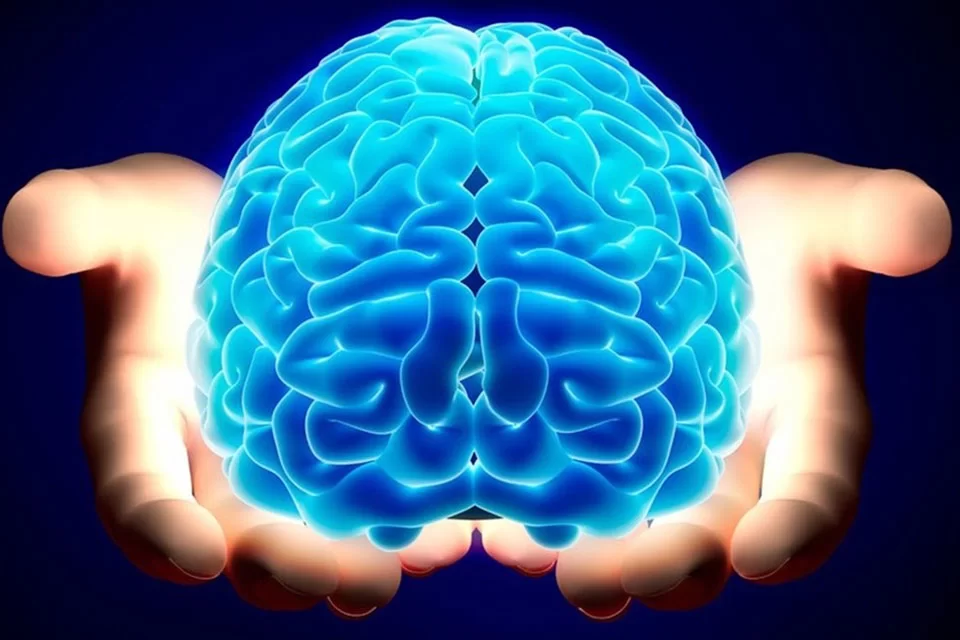

# 🧠 Neuro Technic - Classificação de Sinais de EEG

## 🎯 Objetivo do Projeto
O **Neuro Technic** é um projeto inovador que visa desenvolver um sistema de **classificação de sinais EEG (eletroencefalograma)** em tempo real para identificar o estado de **concentração** 🧘‍♀️ ou **relaxamento** 😌 do usuário. Utilizando **machine learning**, aplicamos técnicas avançadas de processamento de sinais para extrair características dos dados de EEG que possibilitam essa distinção.

## 🛠️ Ferramentas Utilizadas
Aqui estão as principais ferramentas e bibliotecas usadas no projeto:

- **🐍 Python**: Linguagem de programação principal.
- **📊 Numpy e Pandas**: Manipulação de dados e operações numéricas.
- **🧮 Scipy**: Aplicação de filtros e transformadas (como o filtro Butterworth e FFT).
- **🌊 PyWavelets (pywt)**: Extração de features com a transformada wavelet.
- **🔌 Serial**: Comunicação em tempo real com o dispositivo EEG.
- **🤖 Scikit-learn**: Aplicação de modelos de machine learning (como Gradient Boosting Classifier).
- **💾 Joblib**: Salvamento e carregamento do modelo de machine learning treinado.

## 🧑‍💻 Fluxo do Projeto
1. **📡 Coleta de Dados**: O sistema coleta sinais de EEG via comunicação serial com o dispositivo (ex: AD8232).
2. **🧹 Processamento do Sinal**: Aplicamos um filtro passa-baixa para eliminar ruídos, seguido pela transformada FFT e wavelet para extrair as principais características do sinal.
3. **🤖 Classificação**: Usamos um modelo de **machine learning** para classificar o estado do usuário como **concentrado** ou **relaxado** com base nas features extraídas.
4. **⏱️ Interação em Tempo Real**: O sistema processa os sinais continuamente, fornecendo feedback instantâneo sobre o estado mental.

## 🧠 Aplicações Futuras
Este projeto tem diversas possibilidades de uso em diferentes contextos e indústrias, como:

- **🎓 Educação**: Monitoramento em tempo real do nível de concentração de estudantes durante aulas ou sessões de estudo, ajudando a identificar momentos de distração e melhorar a performance acadêmica.
  
- **🏋️‍♂️ Esportes**: Identificação de estados mentais durante treinos de alta performance, auxiliando atletas a maximizar foco em atividades como meditação, ioga, ou até mesmo em momentos de recuperação física.

- **👩‍💼 Ambientes Corporativos**: Uso em escritórios para medir o nível de concentração dos colaboradores, fornecendo insights sobre a produtividade e sugerindo pausas estratégicas para otimizar o desempenho.

- **🧘 Bem-estar e Saúde Mental**: Ferramentas para medição e melhoria de concentração em práticas como meditação e mindfulness, contribuindo para a gestão do estresse e aumento do bem-estar mental.

## 🚀 Contribuições
Gostaríamos de tornar este projeto cada vez melhor e mais acessível. Se você tiver ideias ou melhorias, não hesite em contribuir! 😊

### Como Contribuir:
1. Faça um **Fork** do repositório.
2. Crie uma nova **branch**: `git checkout -b feature/nova-feature`.
3. Faça suas alterações e adicione um **commit**: `git commit -m 'Adiciona nova feature'`.
4. Envie para o repositório: `git push origin feature/nova-feature`.
5. Abra um **Pull Request** e descreva suas alterações.

Qualquer sugestão é muito bem-vinda! 💡

